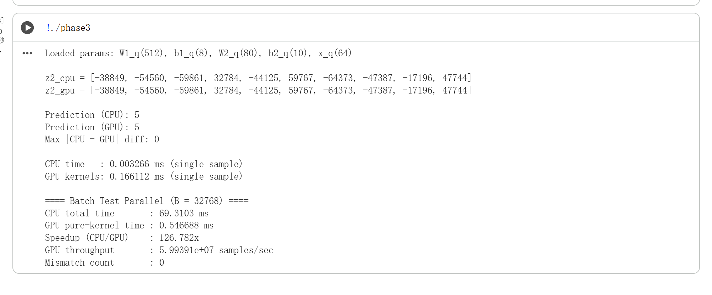

# Phase 3 – CUDA Implementation of Quantized MLP
USC EE 454 
congkang Lyu 


---

## 1. Overview
This project implements the forward pass of a quantized 2‑layer MLP using CUDA.  
The goals are:

1. Load quantized model parameters (`W1`, `b1`, `W2`, `b2`, `x`).
2. Implement GPU kernels for:
   - Hidden layer computation
   - Output layer computation
3. Validate correctness by comparing CPU and GPU outputs.
4. Measure performance for:
   - Single‑sample execution
   - Large batch parallel execution
5. Demonstrate GPU acceleration and throughput.

---

## 2. File Description

### **phase3.cu**
The main CUDA program which includes:
- Memory loading from `.mem` files  
- CPU reference implementation  
- CUDA kernels  
- Timing (CPU vs GPU)  
- Batch parallel test  
- Speedup + throughput reporting  

### **Parameter files**
- `W1_q.mem` — Weight matrix for layer 1  
- `b1_q.mem` — Bias for layer 1  
- `W2_q.mem` — Weight matrix for layer 2  
- `b2_q.mem` — Bias for layer 2  
- `x_sample.mem` — One input sample  

---

## 3. How to Compile and Run

### **Compile**
```bash
nvcc -std=c++14 -arch=sm_75 phase3.cu -o phase3
```

### **Run**
```bash
./phase3
```

---

## 4. Output Explanation

### **4.1 Single Sample Test**
- CPU vs GPU z2 values  
- Predicted class  
- Maximum absolute difference  
- CPU execution time  
- GPU kernel execution time  

### **4.2 Batch Parallel Test**
- Batch CPU time  
- Batch GPU kernel time  
- Speedup = CPU_time / GPU_kernel_time  
- GPU throughput (samples/sec)  
- Mismatch count  

---

## 5. Result Summary (Fill after running)

### **Screenshots**


---

## 6. Notes
- GPU kernel launch overhead makes GPU slower on single samples.  
- GPU shows strong acceleration for large batch sizes.  
- This experiment demonstrates parallelism, not full model accuracy.

---


